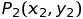

# C-Cpp-exercises
## Exercise 6 & 7
### Caccia al tesoro: il gioco
Un gioco si svolge tra due giocatori: un _Cercatore_ (C) e una _Guida_ (G).

Il _Cercatore_ si muove in una griglia bidimensionale finita di punti con coordinate intere x, y ( 0 <= x < W, 0 <= y < H ). I soli movimenti possibili sono di un passo in direzione N (Nord: verso positivo dell'asse y), S (Sud: verso negativo dell'asse y), E (Est: verso positivo dell'asse x) oppure O (Ovest: verso negativo dell'asse x). Il _Cercatore_ non può ovviamente uscire dalla griglia.

Lo scopo dei giocatori è di far raggiungere al _Cercatore_ la posizione della griglia in cui si trova il _Tesoro_. La _Guida_ conosce perfettamente la griglia, la posizione del _Cercatore_ e quella del _Tesoro_, ma può comunicare al _Cercatore_ soltanto le dimensioni della griglia, la sua posizione (quella del _Cercatore_) e la distanza tra il _Cercatore_ ed il _Tesoro_.

In base alla posizione iniziale del _Cercatore_ ed alla posizione del _Tesoro_, sono concessi al _Cercatore_ un numero massimo di spostamenti pari a quello minimo necessario per raggiungere il _Tesoro_ più due.

Prima di ogni spostamento del _Cercatore_, la _Guida_ gli comunica la sua posizione e la distanza che lo separa dal _Tesoro_. A questo punto il _Cercatore_ sceglie quale spostamento effettuare e lo comunica alla _Guida_.

Il gioco termina con VITTORIA (di tutti i giocatori) quando il _Cercatore_ raggiunge il _Tesoro_, oppure con PERDITA (di tutti i giocatori) quando il _Cercatore_ ha effettuato il numero massimo di spostamenti consentiti senza raggiungere il _Tesoro_.

**NOTA BENE** - Per distanza si intende la usuale distanza euclidea nel piano: dati due punti  e  allora .

Svolgere i seguenti esercizi.
1. Caccia al tesoro (tesoro)
   
   Realizzare un'applicazione che simuli il gioco descritto svolgendo il ruolo di _Guida_ per un _Cercatore_ umano.
2. Caccia al tesoro (oroset)
   
   Realizzare un'applicazione che simuli il gioco descritto svolgendo il ruolo di _Cercatore_ per una _Guida_ umana.
